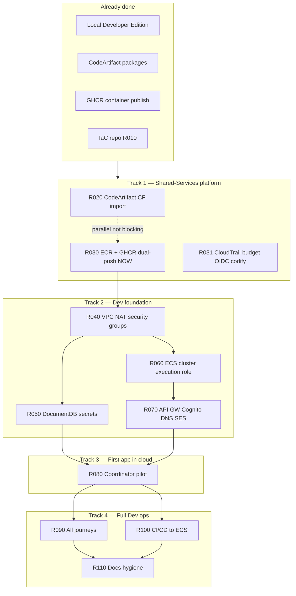

# Live Dev Environment — Integrated Plan

**Status:** Active  
**Last updated:** 2026-06-25  
**North star:** A developer opens a **MentorHub-Dev URL**, signs in, and completes at least the **coordinator journey** end-to-end with data persisted in DocumentDB.

This is the **single integration document** for getting from today's state to that goal. It ties together infrastructure tasks, stack deploy order, cross-repo work, open decisions, and acceptance criteria. Use it as the entry point; drill into linked specs and task files for detail.

| If you need… | Read… |
|--------------|-------|
| **This plan** — full path, dependencies, deploy order, done criteria | *(you are here)* |
| Agile rhythm — what to build **Now / Next / Later** | [CloudDevRoadmap.md](./CloudDevRoadmap.md) |
| Executable work units | [tasks/README.md](../../tasks/README.md) (R010–R130) |
| Platform scope (all environments, service inventory) | [CloudEnvironmentPlan.md](./CloudEnvironmentPlan.md) |
| IaC milestones, governance, risks | [CLOUDFORMATION_PLAN.md](./CLOUDFORMATION_PLAN.md) |
| Tactical task index + repo layout | [CLOUDFORMATION_CHECKLIST.md](./CLOUDFORMATION_CHECKLIST.md) |
| CodeArtifact consumer migration | [DEPENDENCY_MOVE.md](./DEPENDENCY_MOVE.md) |
| Canonical account IDs, SSO, GitHub vars | [aws-platform.yaml](./aws-platform.yaml) |

---

## Definition of done

We track two milestones on the way to a useful Dev environment.

### Milestone A — **Dev is live** (critical path)

**Exit:** Coordinator journey works in AWS MentorHub-Dev.

| Criterion | Evidence |
|-----------|----------|
| Public URL reachable | API Gateway (or agreed interim edge) returns health |
| Sign-in works | Cognito hosted UI **or** documented interim welcome JWT |
| Coordinator SPA loads | Static assets served; `/api/*` proxies to API |
| API round-trip | Coordinator API reads/writes DocumentDB |
| Data seeded | `mongodb_api` configure job run once against DocumentDB |
| Images from ECR | Pilot containers pulled from Shared-Services ECR |

**Tasks:** R010 ✓ → R020/R030/R031 → R040–R070 → **R080**  
**Rough target:** Weeks 3–4 after M1 (Shared-Services) ships.

### Milestone B — **Dev fully operational** (after A)

**Exit:** Full product surface in Dev; merge-to-deploy without console steps.

| Criterion | Evidence |
|-----------|----------|
| All journeys deployed | Customer, mentor, mentee smoke tests pass |
| CI/CD closed loop | Merge to `main` → ECR → ECS (no manual deploy) |
| Docs match reality | Diagrams and runbooks describe deployed Dev |

**Tasks:** R090, R100, R110  
**Out of scope for Milestone A:** Staging (R120), Production (R130) — see [CloudDevRoadmap.md](./CloudDevRoadmap.md) **Later**.

---

## Current state (2026-06-25)

```text
┌─────────────────────┬──────────────────────────────────────────────────┐
│ Area                │ Status                                           │
├─────────────────────┼──────────────────────────────────────────────────┤
│ Local Developer Ed. │ ✓ Complete — Docker Compose, mh, full localhost  │
│ Application code    │ ✓ Builds locally; feature work continues         │
│ CodeArtifact        │ ✓ Live in Shared-Services (560167829275)       │
│ GHCR images         │ ✓ Merge to main → ghcr.io/mentor-forge/*         │
│ IaC repo            │ ✓ Bootstrapped (R010); templates scaffolded      │
│ CF CodeArtifact     │ ◐ R020 — import template merged; execute pending │
│ ECR + GHCR dual-push│ ◐ R030 — **Now** (in progress)                   │
│ MentorHub-Dev runtime│ ✗ No VPC, DocumentDB, ECS, or public URL yet    │
│ Dev account ID      │ ✗ TBD in parameters/dev.json + aws-platform.yaml │
└─────────────────────┴──────────────────────────────────────────────────┘
```

```text
TODAY                              MILESTONE A (Dev is live)
─────                              ─────────────────────────
Local Docker only          ───►    MentorHub-Dev HTTPS URL
GHCR images only           ───►    ECR images → ECS Fargate
CodeArtifact packages      ───►    DocumentDB + Secrets Manager
No AWS app runtime         ───►    Coordinator login → SPA → API → DB
```

---

## Work streams

Four parallel tracks converge at R080. Only **Track 1** is **Now**; Tracks 2–4 start when Shared-Services image pipeline is ready.



### Track 1 — Shared-Services platform (blocks all Dev deploys)

| Task | Deliverable | Status |
|------|-------------|--------|
| [R010](../../tasks/SHIPPED.R010.repo_bootstrap.md) | IaC repo, cfn-lint CI, task framework | ✓ Shipped |
| [R020](../../tasks/RUNNING.R020.codeartifact_import.md) | CodeArtifact domain/repos under CF (import) | Running |
| [R030](../../tasks/RUNNING.R030.ecr_ghcr_connection.md) | ECR repos, `GitHubActionsECRPush`, dual-push pilot | **Now** |
| [R031](../../tasks/PENDING.R031.shared_services_cloudtrail_budget.md) | Shared CloudTrail, $25 budget, CodeArtifact OIDC in CF | Next |

**Gate:** Merge to `main` on a pilot repo produces matching `:latest` in GHCR **and** ECR.

### Track 2 — Dev foundation (MentorHub-Dev account)

Deploy stacks **in order** (see [Stack deploy sequence](#stack-deploy-sequence)). All tasks depend on R030 for ECR pull at runtime.

| Task | Deliverable | Templates |
|------|-------------|-----------|
| [R040](../../tasks/PENDING.R040.dev_governance_network.md) | Account ID recorded, CloudTrail/budget, VPC, NAT, SGs | `dev/cloudtrail`, `dev/network` |
| [R050](../../tasks/PENDING.R050.dev_data_secrets.md) | DocumentDB cluster, Secrets Manager | `dev/documentdb`, `dev/secrets` |
| [R060](../../tasks/PENDING.R060.dev_compute_platform.md) | Fargate cluster, task execution role, log groups | `dev/ecs-cluster` |
| [R070](../../tasks/PENDING.R070.dev_edge_services.md) | API Gateway, Cognito, S3, Route53/ACM, SES | `dev/api-gateway`, `cognito`, `s3`, `route53-acm`, `ses` |

**Gate:** API Gateway URL returns coordinator API health; private subnet egress verified.

### Track 3 — First application in cloud (Milestone A)

| Task | Deliverable |
|------|-------------|
| [R080](../../tasks/PENDING.R080.pilot_coordinator.md) | `coordinator_api`, `coordinator_spa`, optional `welcome` on ECS; `mongodb_api` configure job; smoke test |

**Pilot services (first in ECR):** `mentorhub-coordinator-api`, `mentorhub-coordinator-spa`, `mentorhub-welcome` (see R030).

### Track 4 — Full Dev + automation (Milestone B)

| Task | Deliverable | Repo |
|------|-------------|------|
| [R090](../../tasks/PENDING.R090.remaining_dev_services.md) | Customer, mentor, mentee journeys + runbook_api | This repo (ECS templates) |
| [R100](../../tasks/PENDING.R100.cicd_ecs_deploy.md) | Merge → ECR → ECS; `GitHubActionsECSDeploy` | **Service repos** (workflows) |
| [R110](../../tasks/PENDING.R110.documentation_hygiene.md) | Diagrams and runbooks match deployed Dev | This repo + mentorhub |

---

## Stack deploy sequence

One stack per PR. Validate (`cfn-lint`, `validate-template`) before deploy. Naming: `mentorhub-<env>-<component>`.

```text
SHARED-SERVICES (profile: mentorhub-shared)
  1. codeartifact          R020 — IMPORT (do not recreate; see INFO.md)
  2. github-oidc           R030/R031 — OIDC provider + roles
  3. ecr                   R030 — pilot repositories
  4. cloudtrail            R031 — trail + budget

MENTORHUB-DEV (profile: mentorhub-dev)
  5. cloudtrail            R040 — account governance
  6. network               R040 — VPC, subnets, NAT, security groups
  7. documentdb            R050 — after network exports
  8. secrets               R050 — connection strings, JWT
  9. ecs-cluster             R060 — Fargate cluster + execution role
 10. api-gateway            R070 — edge routing
 11. cognito                R070 — or defer per D-2
 12. s3                      R070 — app buckets
 13. route53-acm             R070 — when domain ready (D-3)
 14. ses                     R070 — when email ready
 15. ecs-services-coordinator R080 — first app services
 16. ecs-services-customer   R090
 17. ecs-services-mentor     R090
 18. ecs-services-mentee     R090 — requires mentee_api CodeArtifact PR
```

Deploy helper: `./scripts/deploy-stack.sh <env> <component> <profile>`

---

## Cross-repo dependencies

| Work | Repo | Blocks |
|------|------|--------|
| Dual-push `docker-push.yml` (pilot) | `mentorhub` or `mentorhub_coordinator_api` | R030.7 |
| Dual-push rollout + ECS deploy workflows | Service repos (`mentorhub_*_api`, `mentorhub_*_spa`) | R100 |
| Dev account ID in aws-platform.yaml | mentorhub `Specifications/` PR | R040.1 |
| `mentee_api` CodeArtifact migration | [mentorhub_mentee_api PR #1](https://github.com/mentor-forge/mentorhub_mentee_api/pull/1) | R090.4 |
| Application architecture / dev diagram | mentorhub `Specifications/` | R080, R110 |
| Local dev login pilot (optional parallel) | mentorhub `Tasks/R102` | Not on critical path |
| Stage0 SPA CodeArtifact | [R108](../../tasks/RUNNING.R108.codeartifact_phase5_stage0_spa.md) | Not on critical path |

**Package vs container split:** CodeArtifact supplies pip/npm packages (already live). ECR supplies container images (R030+). Both are required for cloud Dev but are independent pipelines.

---

## Open decisions

Resolve these to unblock R040, R070, or R080. Record outcomes in [aws-platform.yaml](./aws-platform.yaml) and the relevant task file.

| ID | Decision | Options | Blocks | Owner |
|----|----------|---------|--------|-------|
| **D-1** | MentorHub-Dev AWS account ID | Confirm existing account vs new | R040 | Mike / SRE |
| **D-2** | Dev login interim | Welcome JWT vs Cognito-first | R070.2, R080 | Mike |
| **D-3** | Dev domain + TLS | Owned domain + ACM vs HTTP-only interim | R070.4 | Mike |
| **D-6** | Developer VPN | SSO-only vs Client VPN | R040 | Mike |

Full list (including staging/prod): [CLOUDFORMATION_PLAN.md §7](./CLOUDFORMATION_PLAN.md#7-open-decisions).

---

## Execution model

1. **One feature at a time** — [CloudDevRoadmap.md](./CloudDevRoadmap.md) **Now** = [R030](../../tasks/RUNNING.R030.ecr_ghcr_connection.md).
2. **One task at a time** — Agents and SRE execute the task file end-to-end before promoting Next.
3. **Change control per task** — lint → validate-template → deploy → smoke test → commit → rename to `SHIPPED.`.
4. **Promotion** — When **Now** ships, move top **Next** to **Now** and update CloudDevRoadmap.

```text
NOW   → ECR + GHCR dual-push (R030)
NEXT  → Shared-Services governance (R031)
NEXT  → Dev VPC (R040) → DocumentDB (R050) → ECS (R060) → Edge (R070)
NEXT  → Coordinator pilot (R080)          ← Milestone A: Dev is live
NEXT  → CI/CD (R100) → all journeys (R090) → docs (R110)  ← Milestone B
LATER → test envs · staging (R120) · production (R130)
```

---

## Cost and accounts

| Account | ID | Monthly budget | Primary spend |
|---------|-----|----------------|---------------|
| Shared-Services | `560167829275` | $25 | CodeArtifact, ECR, CloudTrail |
| MentorHub-Dev | **TBD** (D-1) | $50 | ECS Fargate, DocumentDB, NAT, API GW |

Region: `us-east-1` (workloads). SSO Identity Center: `us-east-2`.

---

## Risks on the critical path

| Risk | Mitigation |
|------|------------|
| No ECR images → nothing to run on ECS | R030 before R080; interim GHCR pull only if explicitly documented |
| CodeArtifact import breaks consumers | Import-only change set; smoke pip/npm after R020 |
| Dev account ID unknown | Resolve D-1 before R040 deploy |
| Cognito/domain not ready | Defer R070.2/R070.4; use interim welcome JWT (D-2, D-3) |
| NAT + DocumentDB cost overrun | Budgets in R040; right-size in `parameters/dev.json` |
| Diagram drift | R110; update diagrams in same PR as stack when possible |

---

## Revision history

| Date | Change |
|------|--------|
| 2026-06-25 | Initial integrated plan — ties roadmap, tasks, stacks, cross-repo work |
